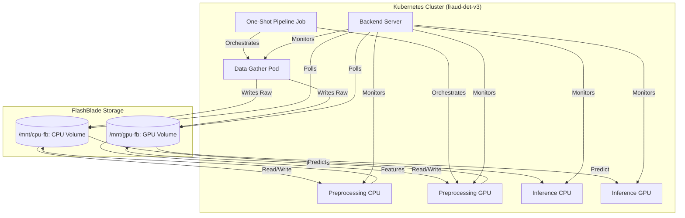

# Fraud Detection v3: Real-Time Pipeline on FlashBlade


---

## Table of Contents

- [Overview](#overview)
- [Architecture](#architecture)
- [Pod Catalog](#pod-catalog)
- [Storage Design](#storage-design)
- [Monitoring & Metrics](#monitoring--metrics)
- [Prerequisites](#prerequisites)
- [Setup & Configuration](#setup--configuration)
- [Building Images](#building-images)
- [Kubernetes Deployment](#kubernetes-deployment)
- [Running the Backend](#running-the-backend)
- [Security & RBAC](#security--rbac)
- [Troubleshooting](#troubleshooting)
- [Project Structure](#project-structure)

---

## Overview

This project implements a financial fraud detection pipeline as a 5-pod containerized architecture, optimized for Pure Storage FlashBlade (high-throughput) and FlashArray (low-latency) storage tiers.

**Key capabilities:**

- Real-time transaction scoring via Triton Inference Server (GPU) and XGBoost (CPU)
- Dual-volume storage architecture isolating CPU and GPU I/O paths on FlashBlade
- Prometheus-based observability spanning FlashBlade bandwidth, IOPS, latency, GPU utilization, and pod CPU
- Continuous and one-shot execution modes
- Horizontal scaling via Kubernetes pod replicas controlled through the backend API

---

## Architecture



### Data Flow

1. **Data Gather** generates synthetic transactions and writes raw parquet batches to both volumes simultaneously.
2. **Preprocessing** pods (CPU or GPU path) read raw files, apply feature engineering, and write feature-complete files back to their respective volume.
3. **Inference** pods consume feature files, run model scoring, and emit results.
4. **Backend Server** monitors all pods and polls storage for queue depth, driving the dashboard.

File sequencing relies on atomic rename operations and sentinel files to prevent race conditions between producers and consumers. Each batch is written to a `.tmp` staging path and renamed to its final path only when complete, ensuring downstream pods never read a partial file.

---

## Pod Catalog

### Data Generation — `data-gather`

Generates synthetic credit card transactions at a configurable rate and archives raw files to both FlashBlade volumes for parallel processing.

| Property | Value |
|---|---|
| Config | `k8s_configs/dual-flashblade.yaml` (lines 102–169) |
| Volumes | Both `/mnt/cpu-fb` and `/mnt/gpu-fb` |
| Continuous mode | `CONTINUOUS_MODE=true` |
| Output format | Parquet batches with atomic rename |

### Preprocessing — `preprocessing-cpu` / `preprocessing-gpu`

Feature engineering pods that transform raw transactions into model-ready feature vectors.

| Path | Library | Volume |
|---|---|---|
| CPU | Polars | `/mnt/cpu-fb` |
| GPU | RAPIDS cuDF | `/mnt/gpu-fb` |

Each pod is pinned to its respective volume to eliminate cross-volume I/O. Features include transaction velocity, merchant category encoding, time-of-day binning, and rolling aggregates.

### Inference — `inference-cpu` / `inference-gpu`

Model serving pods that consume preprocessed feature files and emit fraud probability scores.

| Path | Runtime | Latency Profile |
|---|---|---|
| CPU | XGBoost native | ~5–20ms per batch |
| GPU | NVIDIA Triton Inference Server | Sub-millisecond per batch |

The GPU inference pod exposes:
- `8000` — HTTP/REST endpoint (Triton)
- `8001` — gRPC endpoint (Triton)
- `8002` — Triton metrics (Prometheus-compatible)

---

## Storage Design

FlashBlade is configured with two independent NFS-mounted filesystems to isolate I/O patterns between CPU and GPU workloads:

| Volume | Mount Path | Used By |
|---|---|---|
| CPU filesystem | `/mnt/cpu-fb` | Data Gather, Preprocessing CPU, Inference CPU |
| GPU filesystem | `/mnt/gpu-fb` | Data Gather, Preprocessing GPU, Inference GPU |

### File Lifecycle

```
[raw/batch_<id>.tmp]  →  rename  →  [raw/batch_<id>.parquet]
                                           ↓
                               [features/batch_<id>.tmp]  →  rename  →  [features/batch_<id>.parquet]
                                                                                   ↓
                                                                         [scores/batch_<id>.json]
```

Processed files are moved to a `processed/` subdirectory after consumption. The backend polls `raw/`, `features/`, and `scores/` directories to report queue depths in real time.

---

## Monitoring & Metrics

`prometheus_metrics.py` bridges FlashBlade array telemetry and Kubernetes resource metrics into a unified Prometheus scrape endpoint consumed by the dashboard.

### Prometheus Queries

| Metric | PromQL |
|---|---|
| FlashBlade Read Bandwidth (MB/s) | `sum(purefb_file_systems_performance_bandwidth_bytes{dimension="read_bytes_per_sec"}) / 1024 / 1024` |
| FlashBlade Write Bandwidth (MB/s) | `sum(purefb_file_systems_performance_bandwidth_bytes{dimension="write_bytes_per_sec"}) / 1024 / 1024` |
| FlashBlade IOPS | `sum(purefb_file_systems_performance_throughput_iops)` |
| FlashBlade Latency (ms) | `avg(purefb_file_systems_performance_latency_usec) / 1000` |
| GPU Utilization (%) | `avg(DCGM_FI_DEV_GPU_UTIL)` |
| Pod CPU (millicores) | `sum(rate(container_cpu_usage_seconds_total{namespace='fraud-det-v3'}[1m])) * 1000` |

### Dashboard

The backend serves a live dashboard at `http://localhost:8000/dashboard-v4-preview.html` with real-time charts for all metrics above, pod status, and per-volume queue depths.

---

## Prerequisites

| Dependency | Version | Notes |
|---|---|---|
| Python | 3.9+ | Backend and scripts |
| Kubernetes | v1.30+ | Cluster access required |
| kubectl | Matching cluster | Configured with `fraud-det-v3` namespace access |
| Docker / containerd | Any recent | For building images |
| NVIDIA GPU Operator | Latest | Required for GPU pods |
| NVIDIA DCGM Exporter | Latest | Required for GPU metrics |
| Pure Storage FlashBlade | — | NFS filesystems must be provisioned and mounted |
| Prometheus | v2.x+ | With `purefb` and DCGM exporters configured |

---

## Setup & Configuration

### 1. Clone the Repository

```bash
git clone <your-repo-url>
cd fraud-det-v3
```

### 2. Create the `.env` File

Copy the template and populate values for your environment:

```bash
cp .env.example .env
```

```env
# ── Infrastructure ──────────────────────────────────────
PROMETHEUS_URL=http://10.23.181.153:9090

# Mode: cpu | gpu | dual
CONFIG_MODE=dual

# ── Storage Paths ────────────────────────────────────────
CPU_VOLUME_PATH=/mnt/cpu-fb
GPU_VOLUME_PATH=/mnt/gpu-fb

# ── Pipeline Settings ────────────────────────────────────
# Transactions generated per second in continuous mode
GENERATION_RATE=100000

# balanced | throughput | latency
SYSTEM_PRIORITY=balanced

# Set true to enable FlashBlade-specific Prometheus metrics
PURE_SERVER=true
```

### 3. Install Python Dependencies

```bash
pip install -r requirements.txt
```

---

## Building Images

All images are built via a unified script that handles multi-architecture targets.

```bash
chmod +x build-images.sh
./build-images.sh
```

Or, if a Makefile target is configured:

```bash
make build
```

### Tagging Convention

| Tag | Purpose |
|---|---|
| `:latest` | GPU-optimized or universal components |
| `:cpu` | CPU-bound execution path |
| `:gpu` | GPU-accelerated execution path |

### Image Reference

| Component | Image Name | Arch |
|---|---|---|
| Backend | `fraud-det-v3-backend:latest` | CPU |
| Data Gather | `fraud-det-v3-data-gather:latest` | CPU |
| Data Prep (CPU) | `fraud-det-v3-data-prep:cpu` | CPU |
| Data Prep (GPU) | `fraud-det-v3-data-prep:gpu` | GPU |
| Model Build | `fraud-det-v3-model-build:gpu` | GPU |
| Inference (CPU) | `fraud-det-v3-inference:cpu` | CPU |
| Inference (GPU) | `fraud-det-v3-inference:latest` | GPU |

> **Note:** Push images to your registry before deploying to Kubernetes. Update image references in `k8s_configs/` if your registry path differs from the defaults.

---

## Kubernetes Deployment

### Step 1 — Apply RBAC (one-time)

```bash
# Grants the backend service account pod scaling and node view permissions.
# Also provisions the Prometheus scraper role in the monitoring namespace.
kubectl apply -f k8s_configs/prometheus-rbac.yaml
```

### Step 2 — Deploy Storage and Pods

The backend server auto-applies `dual-flashblade.yaml` on startup. To deploy manually:

```bash
kubectl apply -f k8s_configs/dual-flashblade.yaml
```

This manifest provisions:
- PersistentVolumes and PersistentVolumeClaims for both FlashBlade filesystems
- Data Gather deployment
- Preprocessing CPU and GPU deployments
- Inference CPU and GPU deployments + services
- ConfigMap for shared environment variables

### Step 3 — Run One-Shot Training (one-time or on demand)

```bash
# Sequences: Data Ingest → Preprocessing → Model Training
# This is a Kubernetes Job — it runs once and exits.
kubectl apply -f k8s_configs/model.yaml
```

Monitor job progress:

```bash
kubectl logs -f job/one-shot-pipeline -n fraud-det-v3
```

### Step 4 — Verify Pods

```bash
kubectl get pods -n fraud-det-v3
```

All pods should reach `Running` state. GPU pods require the NVIDIA device plugin to be available on the node.

---

## Running the Backend

The backend server exposes the REST API used by the dashboard to control pods and fetch metrics.

```bash
python backend_server.py
```

Access the live dashboard at:

```
http://localhost:8000/dashboard-v4-preview.html
```

The backend will automatically apply `dual-flashblade.yaml` if the pods are not already running.

### Backend Capabilities

- Scale individual pod deployments (Data Gather, Preprocessing, Inference) via REST
- Stream real-time Prometheus metrics to the dashboard via Server-Sent Events
- Poll FlashBlade volumes for queue depth per stage (raw / features / scores)
- Report node and pod resource utilization

---

## Security & RBAC

The system uses three distinct Kubernetes service accounts with least-privilege roles:

| Account | Role | Permissions |
|---|---|---|
| `fraud-backend` | `fraud-backend-role` | `get`, `list`, `watch`, `update`, `patch` on Deployments; `get`, `list` on Pods |
| `fraud-backend` | `fraud-backend-nodes` | `get`, `list` on Nodes (cluster-scoped) |
| `prometheus-scraper` | `prometheus-scraper-role` | `get`, `list`, `watch` on Pods, Services, Endpoints in `monitoring` namespace |

All roles are defined in `k8s_configs/prometheus-rbac.yaml`. No service account has cluster-admin or wildcard resource access.

---

## Troubleshooting

**GPU pods stuck in `Pending`**
Verify the NVIDIA device plugin DaemonSet is running and that the node has `nvidia.com/gpu` capacity:
```bash
kubectl describe node <node-name> | grep nvidia
```

**FlashBlade volumes not mounting**
Check that the NFS server IP and export path in `dual-flashblade.yaml` match your FlashBlade configuration. Verify NFS connectivity from the node:
```bash
showmount -e <flashblade-data-vip>
```

**Prometheus metrics not appearing**
Confirm `PURE_SERVER=true` in `.env` and that the FlashBlade exporter is reachable from `PROMETHEUS_URL`. Test the exporter endpoint directly:
```bash
curl http://<prometheus-url>/api/v1/query?query=purefb_info
```

**Inference GPU pod CrashLoopBackOff**
Triton requires a model repository to be present on the GPU volume at startup. Ensure `one-shot-pipeline` has completed successfully before the inference pod starts. Check logs:
```bash
kubectl logs deployment/inference-gpu -n fraud-det-v3
```

**Race conditions in file queue**
If you observe duplicate processing or skipped batches, verify that all writes use the atomic `.tmp` → rename pattern. Add `O_SYNC` or `fsync()` calls before rename if the FlashBlade NFS client is not flushing writes promptly.

---

## Project Structure

```
fraud-det-v3/
├── backend_server.py          # FastAPI backend — REST API and dashboard server
├── prometheus_metrics.py      # Metric bridging: FlashBlade + DCGM → Prometheus
├── build-images.sh            # Unified multi-component image build script
├── requirements.txt
├── .env.example
│
├── k8s_configs/
│   ├── dual-flashblade.yaml   # Main deployment manifest (PVs, PVCs, all pods)
│   ├── model.yaml             # One-shot training Job manifest
│   └── prometheus-rbac.yaml   # Service accounts, roles, and role bindings
│
├── data_gather/               # Transaction generator source
├── preprocessing/
│   ├── cpu/                   # Polars-based feature engineering
│   └── gpu/                   # RAPIDS cuDF-based feature engineering
├── inference/
│   ├── cpu/                   # XGBoost CPU serving
│   └── gpu/                   # Triton Inference Server integration
├── model_build/               # Training pipeline (XGBoost + GPU)
│
└── dashboard-v4-preview.html  # Real-time monitoring dashboard
```

---

## License

MIT License — see [LICENSE](LICENSE) for details.